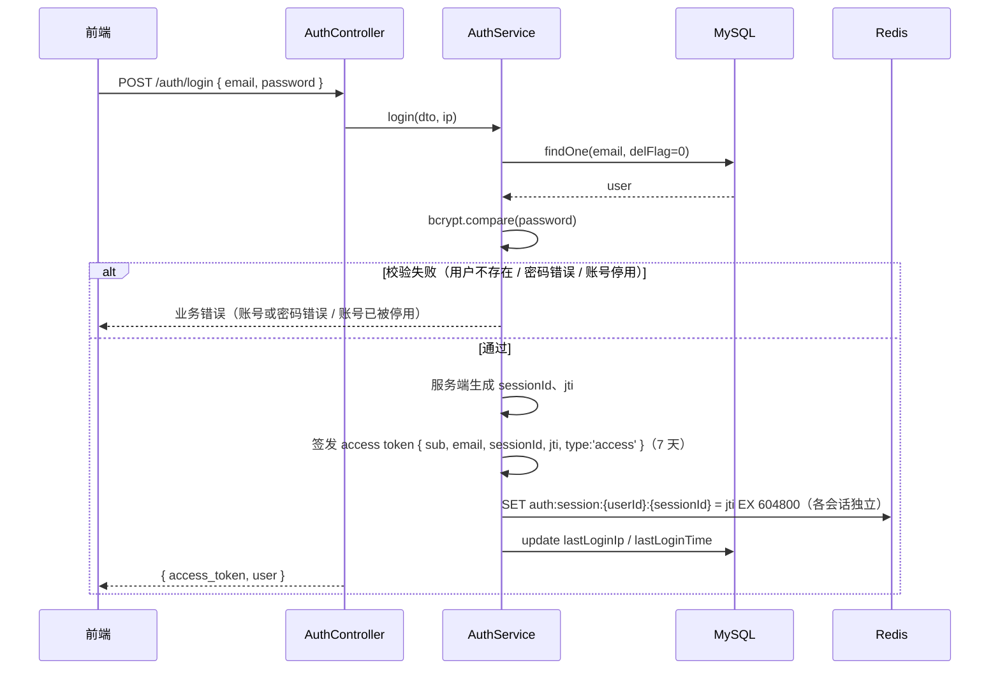
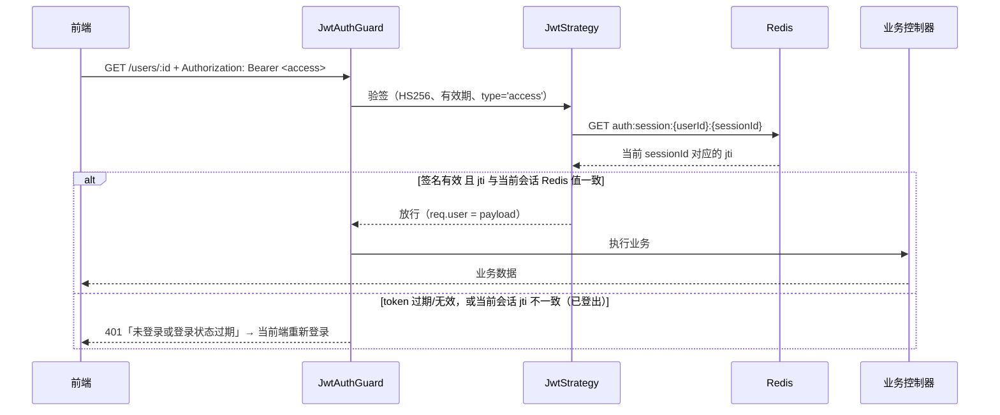
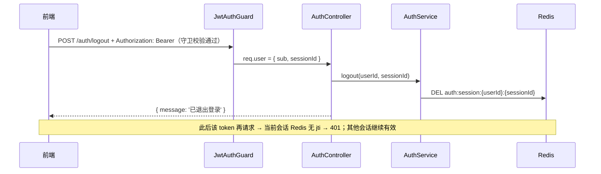

# 认证登录时序图（JWT + Redis 多端会话）

> 对应认证方案：登录签发 access token（有效期 7 天，payload 含 sessionId 和 jti），每个会话的 jti 存 Redis。
> 同一账号可在多个端同时登录，无 refresh 机制；401 只代表当前 token 失效，登出只影响当前会话。
> 日期：2026-08-18

## 1. 登录

## 2. 请求鉴权（每个业务请求）

## 3. 登出（即时失效）

## 关键语义

- **多端登录**：服务端为每次登录生成 sessionId，Redis 按 `auth:session:{userId}:{sessionId}` 保存各会话 jti，同一账号的多个会话互不覆盖
- **请求鉴权**：从 token 的 sessionId 定位对应 Redis 会话，签名、有效期、type 和 jti 均校验通过才放行
- **登出**：只删除当前会话 Redis key，该 token 立即失效，其他会话继续有效
- **过期**：7 天后 token 签名过期 → 验签失败 → 401
- **无 refresh**：401 只代表当前 token 失效，当前端重新登录
