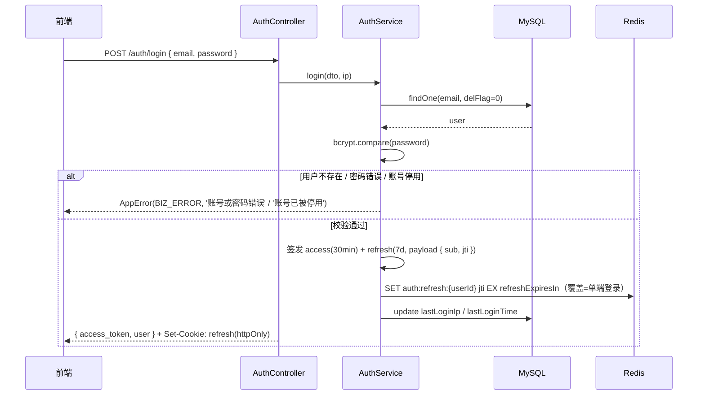
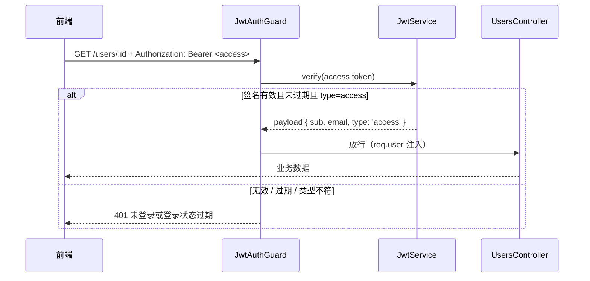
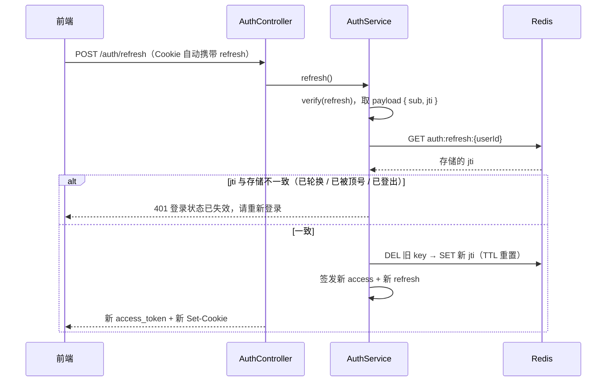
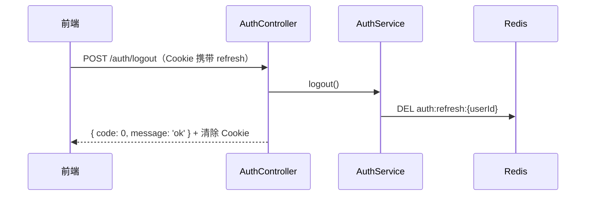

# 认证登录方案设计（JWT access + refresh / Redis）

日期：2026-08-18
状态：已与用户确认

## 背景

项目曾有一套 JWT 认证模块（`src/auth`，`ade5f51` 移除），已删除，但留下三处遗留：`app.module.ts` 残留 `AuthModule` 引用（导致编译失败）、`config.yaml` 的 `jwt` 段、`ErrorCodes.UNAUTHORIZED` 错误码。现重新设计认证登录方案，替换旧的"单 token + DB tokenVersion"模式。

## 决策记录（与用户逐项确认）

| 决策点 | 结论 |
|---|---|
| 方案形态 | JWT access token + refresh token |
| Redis 角色 | 存储 refresh token（支持轮换、主动失效） |
| 多端策略 | 单端登录（新登录顶掉旧会话） |
| 使用场景 | Web 管理后台（refresh 放 httpOnly cookie） |
| 自动续期 | 保留（access 30 分钟 / refresh 7 天，可配） |
| 开发环境 Redis | WSL2 内 Redis 8.0.5（密码 `root`），Windows 侧经 netsh portproxy 固定 `127.0.0.1:6379` 访问 |

## 架构

```
src/
├── auth/                      # 认证模块（重建）
│   ├── auth.module.ts         # JwtModule + TypeOrmModule.forFeature([User]) + RedisModule
│   ├── auth.controller.ts     # POST /auth/login、/auth/refresh、/auth/logout
│   ├── auth.service.ts        # 登录 / 刷新 / 登出逻辑
│   ├── jwt.strategy.ts        # access token 无状态验证（只验签名，不查库）
│   ├── auth.guard.ts          # JwtAuthGuard（全局挂载，@Public() 放行）
│   └── dto/login.dto.ts       # email + password（中文校验消息）
├── redis/
│   ├── redis.module.ts        # 全局模块，ioredis 连接（读 config.yaml）
│   └── redis.service.ts       # 封装 get / set / del / expire
```

### 与旧方案对比的三处改进

1. **access token 完全无状态**：旧方案 `JwtStrategy.validate` 每次请求查 MySQL 校验 `tokenVersion`；新方案只验签名 + 有效期 + `type: 'access'`，不碰数据库。
2. **主动失效用 Redis 而非 DB 字段**：`tokenVersion` 字段已删除，顶号/登出通过操作 Redis 实现。
3. **支持自动续期**：refresh token 轮换，7 天内用户无需重复登录。

## 认证数据流

### 登录 `POST /auth/login`



### 鉴权（每次请求，无状态）



### 刷新 `POST /auth/refresh`（refresh 轮换）



### 登出 `POST /auth/logout`



## Redis 键设计

| Key | Value | TTL | 说明 |
|---|---|---|---|
| `auth:refresh:{userId}` | refresh 的 jti | refreshExpiresIn（7 天） | 登录 SET（覆盖实现单端顶号）；刷新轮换 DEL 后重 SET；登出 DEL |

- **单端登录**：同一 userId 只存一个 jti，新登录覆盖 → 旧 refresh 立即失效；旧 access 为短效 token，最多存活至其自然过期。
- **防重放**：refresh 每次使用后轮换新值，旧 jti 失效；cookie 里的旧 refresh 再次使用会比对失败。

## 安全要点

- access token：payload 仅 `{ sub, email, type: 'access' }`，不含敏感信息。
- refresh token：payload `{ sub, jti }`，`jti` 为 `randomUUID()`。
- refresh 存放：**httpOnly + SameSite=Lax** cookie，`path=/auth/refresh`（仅刷新接口自动携带），生产环境 `Secure`。
- access 有效期短（默认 1800 秒），泄漏窗口可控。
- 密码：bcryptjs（已有依赖），比对用 `compare`。
- 错误：一律 `AppError`，`ErrorCodes.BIZ_ERROR`（账号密码错误/账号停用）、`ErrorCodes.UNAUTHORIZED`（401 场景）。

## 配置变更（config.yaml）

```yaml
# Redis 连接
redis:
  host: 127.0.0.1
  port: 6379
  password: root

# JWT 配置
jwt:
  secret: 'nest-practices-secret-key'
  accessExpiresIn: 1800     # 秒
  refreshExpiresIn: 604800  # 秒
```

## 配套改动

1. `src/app/app.module.ts`：移除 `AuthModule` 残留引用（已在本设计文档提交前修复，恢复编译）。
2. `GET /users/:id` 挂 `JwtAuthGuard` 作为受保护接口示例，同步更新其 e2e 测试。
3. 新增依赖：`ioredis`。

## 开发环境 Redis 打通（portproxy）

WSL2 内 Redis 8.0.5 运行于 `127.0.0.1:6379`（密码 `root`）；Windows 侧 localhost 转发失效，NAT 直连 WSL IP 可用。

1. 修改 WSL 内 `/etc/redis/redis.conf`：`bind 0.0.0.0`（需 sudo），重启 redis 服务。
2. 新增 `scripts/redis-link.sh` + pnpm 脚本 `redis:link`：获取当前 WSL IP → `netsh interface portproxy` 将 `127.0.0.1:6379` 转发到 WSL Redis。WSL 每次重启后运行一次（需管理员权限）。
3. `config.yaml` 固定 `127.0.0.1:6379`，与生产环境同构。

## 测试计划

- **单元**（`auth.service.spec.ts`）：登录成功/密码错误/用户不存在/账号停用、refresh 一致放行/不一致拒绝、轮换后旧 jti 失效、登出后 jti 删除、单端顶号（旧 jti 被覆盖）。
- **守卫**：无 token / 过期 token / 非 access 类型 → 401；有效 token → 放行。
- **E2E**（`auth.e2e-spec.ts`）：登录 → 带 access 访问 `GET /users/:id` → 刷新换新 access → 旧 refresh 复用失败 → 登出后 refresh 失效。

## 明确不做（YAGNI）

- 注册接口（管理后台由管理员建号，`pnpm seed` 已有初始用户）
- 图形验证码、短信/邮件验证码
- 找回密码 / 修改密码
- 多端同时在线
